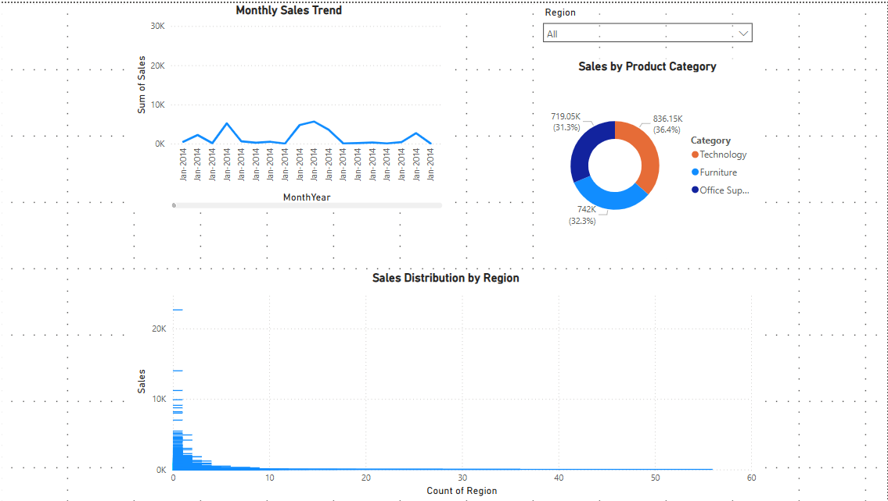

#  Simple Sales Dashboard (Power BI)

This work presents a clean, interactive sales dashboard using Power BI. The dashboard summarizes sales performance by **region**, **category**, and **month-year**.

##  Tools Used

- Power BI (for visual design & dashboard)
- Superstore_Sales.csv dataset

##  Project Files

- `sales_dashboard.pbix` — Main Power BI dashboard
- `dashboard_screenshot.png` — Visual preview of dashboard
- `insights.txt` — 3–4 written insights from the visuals
- `Superstore_Sales.csv` — Dataset used for the dashboard

##  Visual Components

-  **Line Chart** – Sales trends over Month-Year
-  **Bar Chart** – Sales by Region
-  **Donut Chart** – Sales by Category
-  **Slicer** – Region filter for dynamic exploration

##  Key Takeaways

- Creating visuals from raw sales data
- Designing readable dashboards for business stakeholders
- Interactivity with filters and slicers

##  Preview

